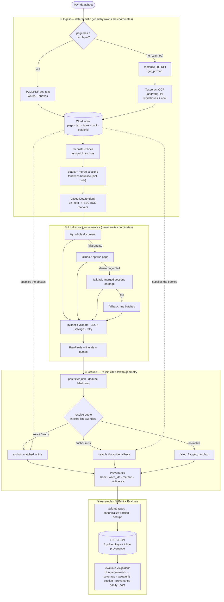

# Generic Datasheet Field-Extraction Pipeline

**Design document** — a hybrid PDF-geometry + LLM pipeline that extracts structured fields from process datasheets with word-level provenance.

**Status:** Implemented. See [Measured Results](#measured-results) for dev-set scores on the v3 pipeline.

---

## Table of Contents

1. [Executive Summary](#executive-summary)
2. [Problem & Constraints](#problem--constraints)
3. [Input Characteristics](#input-characteristics)
4. [Design Principles](#design-principles)
5. [Architecture](#architecture)
6. [Module Layout](#module-layout)
7. [Pipeline Layers](#pipeline-layers)
8. [Measured Results](#measured-results)
9. [Cost Model](#cost-model)
10. [Failure Modes](#failure-modes)
11. [Generality & Trade-offs](#generality--trade-offs)
12. [Prior Art & Positioning](#prior-art--positioning)
13. [Future Improvements](#future-improvements)
14. [Resources](#resources)

---

## Executive Summary

Given a process datasheet PDF (pump specs: flows, pressures, materials, motor, seal, notes), reproduce the structured fields in `golden/*.json` — `{name, value, unit, section, context}` per field — **generically**, so the same code extends to other equipment types, layouts, and companies.

The four provided sheets are a **development set, not the target**. Per-sheet lookups are explicitly penalized.

| Priority | Axis |
|----------|------|
| 1 | **Generality** — no hard-coded field dictionaries or sheet-specific rules |
| 2 | **Provenance** — word-level bounding boxes for both label and value |
| 3 | **Quality** — coverage + value/unit correctness |
| 4 | **Cost** — per-document cost, plus understanding of *where/why* it fails |

**Stack (as implemented):** Python · **Azure OpenAI** (`gpt-4o` deployment) via OpenAI SDK · Tesseract OCR for scanned pages · No UI · No deployment.

**Core principle:** Deterministic PDF geometry owns the coordinates; the LLM owns the semantics. The model never emits a coordinate — it cites text it read, and we resolve that text back to word bboxes we control.

---

## Problem & Constraints

**Goal.** Build an extraction pipeline that:

- Takes any datasheet PDF and emits structured fields matching the golden schema.
- Ties every field back to exact word locations in the source PDF.
- Generalizes beyond the four dev sheets without per-document configuration.

**Evaluation axes** (in priority order):

1. Generality
2. Provenance (word-level bboxes for label **and** value)
3. Quality (coverage + value/unit correctness)
4. Cost (per-doc, plus failure analysis)

---

## Input Characteristics

Verified by probing the PDFs and reading all four golden files.

### PDF types in the dev set

| Sheet | Type | Notes |
|-------|------|-------|
| `pds-P718.pdf` | Text-based | English · Acrobat PDFMaker/Excel · 2–3 pages |
| `pds-P818.pdf` | Text-based | English · Acrobat PDFMaker/Excel · 2–3 pages |
| `pds-P300228.pdf` | Text-based | **Bilingual FR/EN** · Bluebeam Revu · 2–3 pages |
| `pds-P600173.pdf` | **Scanned image** | **Bilingual FR/EN** · ~300 DPI raster per page · **no text layer** |

> **Important:** `pds-P600173.pdf` has zero fonts, zero text operators, and no OCR text layer (verified by decoding streams). The dev set **requires an OCR path** — text extraction alone yields zero fields on P600173.

### Golden schema behavior

- **`value`** is always a string or `null`. `null` means "field present on the sheet but blank" — a **correct answer**, not a miss.
- **Null ratio is bimodal:** ~17%/10% (P718/P818) vs ~55%/61% (P300228/P600173).
- **`name`** is canonical English even on French sheets (raw label → normalized English term, with duplicates disambiguated, e.g. `Revision 00 Date`, `Off-Spec Case ...`). This label→name step is **not rule-derivable** — it is the core reason an LLM belongs in the loop.

### Layout patterns observed

- Simple `label:value` pairs
- Table cells with column-header `context` (operating cases: Normal / Off-Spec / Min)
- Checkbox/binary fields (`value:"DISCONTINUOUS"`, context `"checkbox is filled"`)
- Long free-text NOTES/REMARKS with note refs as `context` (`"per note (15)"`)
- Bilingual, punctuation-inconsistent sections (`NOTES` vs `NOTES:`)

---

## Design Principles

### Hybrid, not pure-rules or pure-LLM

| Approach | Strength | Weakness |
|----------|----------|----------|
| Pure rules | Reliable coordinates | Cannot produce canonical English names from French labels generically |
| Pure LLM | Semantic understanding | Cannot be trusted for pixel coordinates |
| **Hybrid (chosen)** | Both generality and provenance | More moving parts, but each layer has a clear owner |

### Simplicity stance

One primary path per layer. Deliberately **not** built up front (documented under [Future Improvements](#future-improvements)):

- Docling / `spacy-layout` for complex layouts
- Neural OCR for noisy scans
- Label:value geometric pairing for tables
- Multi-column reading-order handling
- A second model pass

Each is a config/dependency swap away, not a feature shipped on day one.

---

## Architecture

Five layers, left to right:

```
PDF ──► (1) Ingest            words + lines + merged sections  (PyMuPDF; OCR if no text layer)
        (2) LLM Extract       hybrid chunk → fields + cited line-anchor + verbatim quotes
        (3) Post-filter       drop junk / dedupe by label line
        (4) Ground            cited text ─► exact word bbox(es)  (anchor → search → fail)
        (5) Assemble/Emit/Eval ONE JSON (5 golden keys + inline provenance); score vs golden
```



The dotted edges encode the core principle: bounding boxes always come from the deterministic Word index. The LLM only cites which text it read (line id + verbatim quote), never coordinates.

---

## Module Layout

```
datasheet_extract/
  cli.py                 # `extract <pdf>` · `evaluate <pred> <gold>` · `report` · `ingest-dump`
  config.py              # Azure endpoint, deployment, pricing, OCR/chunk/filter thresholds
  pipeline.py            # ingest → extract → filter → ground → assemble → emit
  model.py               # dataclasses: Word, Line, Section, RawField, Provenance, FieldOut
  ingest/
    words.py             # build_word_index(pdf) → list[Word]  (PyMuPDF; Tesseract OCR fallback)
    lines.py             # reconstruct_lines(words) → list[Line]  (y-cluster, x-sort)
    sections.py          # detect_sections + merge micro-sections  (font/caps heuristics)
    layout_doc.py        # LayoutDoc: render by page/section/line_ids; sections_on_page()
  llm/
    client.py            # Azure OpenAI client; usage capture; retry; JSON salvage
    prompt.py            # principle-based system prompt + synthetic few-shot (NO field dictionary)
    schema.py            # pydantic model of per-field output + validation
    extract.py           # hybrid chunking: doc → page → section-on-page → line-batch
  ground/
    provenance.py        # ground_field(rf, doc) → Provenance  (quote+line → word bbox)
    normalize.py         # numeric/locale/unit normalization (for MATCHING only)
  emit.py                # post-filter raw fields; ONE JSON with inline provenance
  eval/
    match.py             # order-independent field matching (Hungarian assignment)
    metrics.py           # coverage, value/unit/section/context, provenance-sanity, cost
    report.py            # per-field diff table + aggregate + per-doc cost
  data/units.py          # unit equivalence table (m3/h≡m³/h, °F glyphs…) for compare only
tests/                   # ingest, grounding, eval math, OCR, post-filter
```

### Key data shapes (`model.py`)

| Type | Purpose |
|------|---------|
| `Word{id, page, text, x0, top, x1, bottom, size, bold, conf}` | Stable `id` in reading order; `conf=1.0` for text layer, OCR confidence for scans |
| `Line{id, page, word_ids, text, bbox}` | **`id` is the anchor the LLM cites** (~40–120 lines/page) |
| `RawField{name, value, unit, section, context, label_line_id, value_line_id, label_quote, value_quote}` | LLM output — **no coordinates** |
| `Provenance{label_page, label_bbox, label_word_ids, value_page, value_bbox, value_word_ids, method, confidence}` | `method ∈ {anchor, search, failed}` |
| `FieldOut{name, value, unit, section, context, provenance}` | Final record: 5 golden keys + inline `provenance` |

---

## Pipeline Layers

### Layer 1 — Ingestion

**Library:** [PyMuPDF](https://pymupdf.readthedocs.io/) (`fitz`) — word bboxes and font size/flags in one pass via `get_text("words")` + `get_text("dict")`. No pdfplumber adapter, no Docling.

**Steps:**

1. **Words** → `Word` list with stable integer `id` in reading order.
2. **Lines** → cluster words by `top` within a page using tolerance derived from *median glyph height*; x-sort within line. Reading order = page → top → x0.
3. **Sections** → header iff `size > p75(body size)` OR bold OR (all-caps AND short AND left-aligned). **Merge micro-sections** (<3 lines) into the previous section. Reject footnote fragments (`HANDLED 14`), digit-heavy lines, and single-word headers <8 chars.

After merge, typical section counts: P718/P818 ~7, P300228 ~18, P600173 ~30 (down from 166–191 before merge).

This layer is LLM-free and unit-tested (`ingest-dump` CLI for eyeballing `render()` output).

#### Text vs. image detection → OCR fallback

Before word extraction, **for each page:** try the text layer; if it yields fewer than 5 words, rasterize and OCR. Both paths emit the same `Word` shape.

| Setting | Value |
|---------|-------|
| OCR engine | Tesseract via `pytesseract.image_to_data(..., lang="eng+fra")` |
| Rasterize | PyMuPDF `page.get_pixmap(dpi=300)` |
| Why Tesseract | Word-level boxes + per-word confidence natively; local, free, CPU-only |

**OCR caveat:** Character errors (`0`↔`O`, dropped accents). Low OCR `conf` propagates to field confidence and post-filter.

---

### Layer 2 — LLM Extraction

**Client:** Azure OpenAI via OpenAI SDK (`AzureOpenAI`). Deployment default: **`gpt-4o`** on endpoint `AZURE_ENDPOINT_GPT4`.

| Setting | Value |
|---------|-------|
| API version | `2024-02-15-preview` |
| `temperature` | 0 |
| `max_tokens` | 4096 (deployment completion limit) |
| `response_format` | `{"type":"json_object"}` |

Environment variables:

- `OPENAI_API_KEY_GPT4` (or `AZURE_OPENAI_API_KEY`)
- `AZURE_ENDPOINT_GPT4` — e.g. `https://r2d2-ai.openai.azure.com/`
- `AZURE_DEPLOYMENT_GPT4` — optional, defaults to `gpt-4o`

**Output handling:**

- Schema in prompt; validate with pydantic + retry (1–2 retries)
- **JSON salvage** — truncated responses recovered by progressively closing the `fields` array
- On final failure, fall back to coarser chunking (see below)

#### Hybrid chunking strategy (implemented)

Azure's 4096-token completion limit prevents reliable single-call extraction on 95–107-field sheets. The implemented fallback chain:

| Step | When | Calls per 3-page doc |
|------|------|----------------------|
| 1. Whole document | Always tried first | 1 |
| 2. Whole page | Fallback; only if page has ≤45 lines | 1–3 |
| 3. Merged sections on page | Dense pages (>45 lines) or page call failed | ~7–18 per doc |
| 4. Line batches (40 lines) | Section call failed | rare |

Section chunks are scoped to **one page** (`render(section_id=…, page=…)`) so the model sees local context without 191 micro-section calls.

**Prompt principles (never a field list):**

- Emit one field per labeled datum, **including present-but-blank → `value:null`**
- `name` = canonical English Title-Case; translate FR/bilingual labels; disambiguate repeats
- `context` = short disambiguator (column, operating case, checkbox state, note ref)
- Cite `label_line_id` / `value_line_id` and **verbatim** `label_quote` / `value_quote`
- 2–3 **synthetic** few-shot examples — teaches shape without training on dev golden

**User payload:** Rendered `LayoutDoc` — each line as `L<id> | <text>` with `[SECTION] …` markers.

---

### Post-filter (between extract and ground)

Implemented in `emit.filter_raw_fields()` — drops before grounding to save cost and improve precision:

- Numeric-only or junk names (`42`, `---`)
- Boilerplate patterns (`Confidential`, `General Note N`, `Section Title`, …)
- Low alpha ratio (OCR garbage)
- Short names (≤5 chars) on low-OCR-confidence lines (`conf < 0.55`)
- **Dedupe by `label_line_id`** — keep best name/value per line

---

### Layer 3 — Provenance Grounding

**Approach:** Line-anchor + deterministic word-localization, with quote-driven fallback.

| Alternative | Why rejected |
|-------------|--------------|
| Bare string search | Duplicate values → wrong bbox silently; can't ground null-value labels |
| Word-level LLM anchors | ~2× input tokens; models mis-copy integer lists |

**Algorithm** — `ground_field(rf, doc)` for each of `{label, value}`:

```
if side==value and rf.value is None:
    record null-value provenance; continue

q = normalize(quote)
window = cited line ±1–2 lines within same section (else whole doc)

# anchor: exact or fuzzy (≥0.8) match in window → local_align → contiguous word run
#         conf = min(1.0/0.8, min word conf from OCR)
# search: doc-wide scan; disambiguate by proximity to label bbox / section
#         conf = 0.5 (0.35 if many candidates)
# failed: no run found → method=failed, bbox=None

bbox = union(run word bboxes)
```

Every field carries `method` + `confidence` — weak grounding is **flagged, never silently wrong**.

---

### Layer 4 — Assemble & Emit

1. **Type/shape:** `value ∈ {str, null}`; coerce non-strings; drop malformed records.
2. **Section:** Keep model's string; canonicalizer collapses trailing-colon drift (`NOTES` / `NOTES:`).
3. **Dedup:** Collapse exact `(name, value, section, context, value_line_id)` tuples.
4. **Emit:** One JSON file — 5 golden keys + inline `provenance` per field. Eval compares golden keys only; provenance is ignored for scoring.

---

### Layer 5 — Evaluation

Order-independent matching via **Hungarian assignment**:

```
score = 0.55·name_sim + 0.30·value_match + 0.10·section_sim + 0.05·context_sim
threshold ≥ 0.5
```

| Metric | Description |
|--------|-------------|
| Coverage / recall | matched_gold / total_gold (includes correct nulls) |
| Precision | matched_pred / total_pred |
| Value correctness | On matched pairs; **null-accuracy broken out separately** |
| Unit correctness | Via `data/units.py` equivalences |
| Section + context | Section accuracy; loose context overlap |
| Provenance-sanity | Does cited bbox text contain the value? By `method` |
| Cost | Per-doc tokens + dollars |

**Reporting:** Per-field diff `[MATCH / VALUE-MISMATCH / UNIT-MISMATCH / MISSING / EXTRA]` with method/confidence.

**CLI:**

```bash
datasheet-extract report --pdf-dir . -o out/   # extract all 4 PDFs + evaluate
```

Logs written to `out/evaluation-v3.log` (or user-specified path via `tee`).

---

## Measured Results

Dev-set evaluation with **Azure GPT-4o**, hybrid chunking, section merge, and post-filter (v3 pipeline, `out/evaluation-v3.log`):

| Document | Recall | Precision | Value | Null | Unit | Cost |
|----------|--------|-----------|-------|------|------|------|
| pds-P718.pdf | 71.6% | 84.0% | 82.4% | 85.7% | 75.0% | $0.32 |
| pds-P818.pdf | 67.6% | 83.1% | 75.4% | 100% | 68.0% | $0.28 |
| pds-P300228.pdf | 50.6% | 76.5% | 53.8% | 53.5% | 55.6% | $0.36 |
| pds-P600173.pdf | 63.2% | 68.5% | 75.5% | 94.4% | 20.8% | $0.39 |
| **TOTAL** | **61.9%** | **76.5%** | — | — | — | **$1.35** |

Provenance sanity: **96–100%** on matched non-null values.

### Iteration history (why v3)

| Version | Chunking | Recall | Precision | Notes |
|---------|----------|--------|-----------|-------|
| v1 | Section ×191 (pre-merge) | **77.7%** | 57.0% | High recall, many junk EXTRAs |
| v2 | Page only | 57.9% | **80.1%** | JSON truncation on dense pages |
| **v3** | **Hybrid page → section** | **61.9%** | **76.5%** | Best precision/cost balance |

**Remaining gaps:** P300228 bilingual operating-case tables (recall ~51%); P600173 unit accuracy (~21%); section string match vs golden bilingual headings (~0% exact); OCR fragments occasionally pass post-filter when embedded in note fields.

---

## Cost Model

Measured via `client.py` usage capture; rates from `config.py`.

**Azure GPT-4o ballpark:** ~$2.50 / $10.00 per 1M input/output tokens.

| Per document (v3 hybrid) | Typical |
|--------------------------|---------|
| LLM calls | 1 try + ~7–20 section chunks |
| Total cost | **$0.28–0.39** per sheet |
| Full dev set (4 PDFs) | **~$1.35** |

**Cost levers:** Fewer chunks (accept lower recall); cheaper deployment (one config line); post-filter before ground (already implemented).

---

## Failure Modes

| Failure | Cause | How it surfaces |
|---------|-------|-----------------|
| Wrong bbox on duplicate value | `search` picked wrong occurrence | `method=search`, low conf; provenance-sanity |
| Missed field | Chunk missed operating-case column / truncated JSON | MISSING diff rows; coverage metric |
| Hallucinated / junk field | OCR noise or footer text | Post-filter; EXTRA rows; precision |
| Wrong canonical name | FR→EN translation disagreement | Fuzzy name-match fails; diff shows pred→gold |
| Wrong section string | Model emits short header vs bilingual golden | Section-accuracy ~0% (exact match) |
| Multi-column scramble | Line clustering merged columns | Garbled lines in ingest dump |
| Truncated JSON | 4096 output token limit | JSON salvage + section/page fallback |
| OCR misread on scan | Tesseract errors | Low word `conf`; value mismatches on P600173 |

---

## Generality & Trade-offs

**What guarantees extension to unseen sheets:**

1. No per-sheet maps or field dictionary — LLM infers from visible labels via principles
2. Ingestion uses font/geometry heuristics, not template coordinates
3. Model re-emits `section` from context — header detection need not be perfect
4. Synthetic few-shot avoids training on dev golden
5. Scanned PDFs handled by per-page OCR (P600173 exercises this path)

| Trade-off | Choice | Rationale |
|-----------|--------|-----------|
| Single call vs hybrid chunking | **Hybrid** | Azure 4096 output limit; v1 single-call truncates on 95+ fields |
| Section merge | **Merge <3 lines** | 166 micro-sections → 18; cuts junk EXTRAs and API cost |
| Post-filter | **Yes, before ground** | Precision 57% → 77% without per-sheet rules |
| Line-anchor vs word-anchor | Line-anchor | Cheaper tokens, more reliable citation |
| Azure vs Groq | **Azure GPT-4o** | Available deployment; stronger instruction-following |
| Heuristic sections vs Docling | Heuristic + merge | LLM owns final `section`; upgrade if layouts get harder |

---

## Prior Art & Positioning

### Unstract (Zipstack)

NL-prompt → clean JSON; validates LLM approach. **Not used** — no provenance, AGPL-3.0, heavyweight platform vs CLI brief.

### Explosion `spacy-layout` + Docling

Deferred ingest upgrade for complex/nested tables. Layer 1 stays PyMuPDF + Tesseract for now.

---

## Future Improvements

Reached for only when eval shows the current path isn't enough:

- **Operating-case table few-shot** — recover Off-Spec / Min columns on P300228 (biggest recall gap)
- **Label:value geometric pairing** in ingest — split table rows before render
- **Unit split post-process** — `480.0 °F` → `value` + `unit`; extend `units.py`
- **Section fuzzy eval / prompt** — copy full bilingual `[SECTION]` marker verbatim
- **OCR preprocess** — deskew/denoise; filter `conf < 60` words before line build
- **Docling / `spacy-layout`** — trained layout for nested tables
- **Neural OCR** (PaddleOCR / EasyOCR) — noisy scans
- **Multi-column reading-order** — column split before line clustering

---

## Resources

### Development set

| PDF | Golden output | Fields (approx.) |
|-----|---------------|------------------|
| `pds-P718.pdf` | `golden/pds-P718.json` | 95 |
| `pds-P818.pdf` | `golden/pds-P818.json` | 102 |
| `pds-P300228.pdf` | `golden/pds-P300228.json` | 154 |
| `pds-P600173.pdf` | `golden/pds-P600173.json` | 155 |

### Python dependencies

| Package | Role |
|---------|------|
| [PyMuPDF](https://pymupdf.readthedocs.io/) | PDF text extraction, rasterization, word bboxes |
| [OpenAI Python SDK](https://github.com/openai/openai-python) | Azure OpenAI client |
| [Pydantic](https://docs.pydantic.dev/) | LLM output validation |
| [RapidFuzz](https://github.com/rapidfuzz/RapidFuzz) | Fuzzy matching (grounding + eval) |
| [SciPy](https://scipy.org/) | Hungarian assignment |
| [pytesseract](https://github.com/madmaze/pytesseract) + [Pillow](https://pillow.readthedocs.io/) | OCR pipeline |

### System dependencies

| Tool | Install |
|------|---------|
| [Tesseract OCR](https://github.com/tesseract-ocr/tesseract) with `eng` + `fra` | `brew install tesseract tesseract-lang` |

### LLM provider (as configured)

| Provider | Deployment | Env vars |
|----------|------------|----------|
| Azure OpenAI | `gpt-4o` | `OPENAI_API_KEY_GPT4`, `AZURE_ENDPOINT_GPT4`, optional `AZURE_DEPLOYMENT_GPT4` |

### CLI usage

```bash
pip install -e ".[dev]"

export OPENAI_API_KEY_GPT4='...'
export AZURE_ENDPOINT_GPT4='https://your-resource.openai.azure.com/'

# Eyeball ingest (no LLM)
datasheet-extract ingest-dump pds-P718.pdf -o out/pds-P718.render.txt

# Extract one PDF
datasheet-extract extract pds-P718.pdf -o out/pds-P718.json

# Evaluate against golden
datasheet-extract evaluate out/pds-P718.json golden/pds-P718.json

# Full dev-set extract + evaluate
datasheet-extract report --pdf-dir . -o out/
```
